# Doge Emporium

Doge Emporium is an expanded DApp based on [Truffle's Pet Shop Tutorial](https://www.trufflesuite.com/tutorials/pet-shop), where the shop is offering a special "Buy one and get your second free" discount.

### About
To purchase a doge, the user needs to connect their [MetaMask Wallet](https://metamask.io). Once connected, the user's current wallet address will display below the shop logo. The owner of the shop can also revert all transactions, which allows customers to withdraw amounts they spent int the store. Only the owner can reset shop transactions and only customers who previously made purchases may withdraw ETH.


## Installation

There are a few technical requirements before we start. Please install the following:

 - [Node.js v8+ LTS and npm (comes with Node)](https://nodejs.org/en/)
 - [Git](https://git-scm.com/)

Once we have those installed, we only need one command to install Truffle:
```Bash
npm install -g truffle
```

Clone this repo to your local machine:
```Bash
git clone https://github.com/jun-sung/doge-emporium.git
cd doge-emporium
```

Then install all the project dependencies:
```Bash
npm install
```

## Compiling, migrating, and testing the smart contract

Solidity is a compiled language, meaning we need to compile our Solidity to bytecode for the Ethereum Virtual Machine (EVM) to execute. Since our DApp is setup as a Truffle project, we'll be utilizing Truffle's command tools to compile, migrate, and test our smart contract on a local blockchain.

### Compilation

Within the project directory, run the following commands in the terminal:
```Bash 
truffle compile
```

You should see output similar to the following:  
  

### Migration

If there are no errors, we've successfully compiled our contracts and now we can migrate them to the blockchain!

Before we can migrate our contract to the blockchain, we need to have a blockchain running. In this walkthrough, we'll use [Ganache](https://www.trufflesuite.com/ganache), a personal blockchain for Ethereum development you can use to deploy contracts, develop applications, and run tests. If you haven't already, [download Ganache](https://www.trufflesuite.com/ganache) and double click the icon to launch the application.

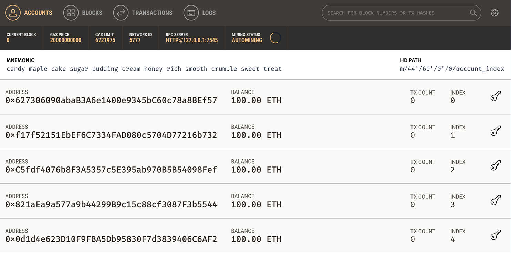  

You can also run the [command line version](https://github.com/trufflesuite/ganache), `ganache-cli` via npm:
```Bash
npm install -g ganache-cli
```

By default, Ganache should be running on port 7545. The details can be seen in the **RPC Server**.

  

Our truffle-config.js file is currently set to run development on Port 8545.
```javascript
networks: {
    development: {
      host: "127.0.0.1",
      port: 8545,
      network_id: "*" // Match any network id
    },
}
```

So change the Port Number to 8545 under the **Server** tab in **Settings**.  

Back in our terminal, migrate the contract to the blockchain.
```Bash
truffle migrate
```

You should see output similar to the following:  

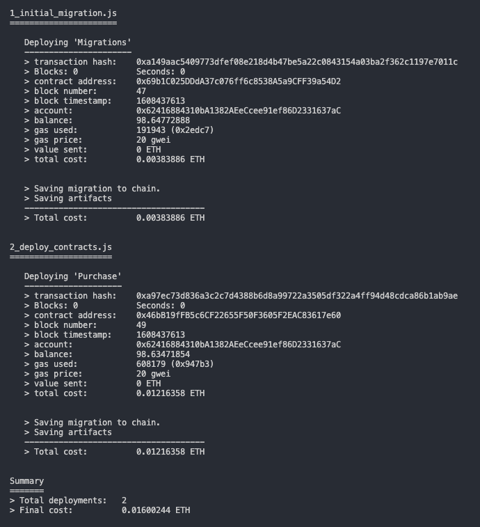  

### Testing

If migration is successful, we can now run the pre-written Solidity tests:
```Bash
truffle test
```

If all the tests pass, you'll see console output similar to this:  

  


## Interacting with the DApp in a browser 

Now we're ready to use our DApp!

### Installing and configuring MetaMask 

The easiest way to interact with our dapp in a browser is through MetaMask, a browser extension for both Chrome and Firefox.

1. Install MetaMask in your browser.
2. Once installed, a tab in your browser should open displaying the following:  

  

3. After clicking **Getting Started**, you should see the initial MetaMask screen. Click **Import Wallet**.  

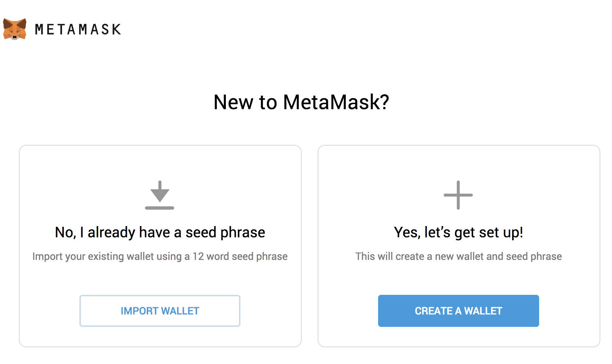  

4. Next, you should see a screen requesting anonymous analytics. Choose to decline or agree.  

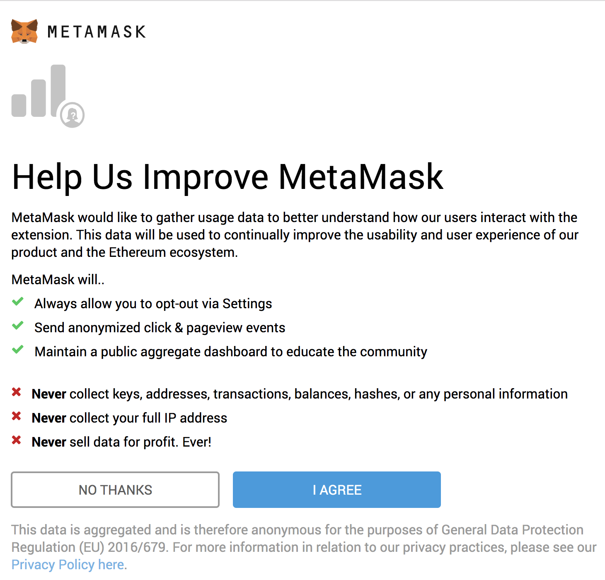  

5. In the box marked **Wallet Seed**, enter the mnemonic that is displayed in Ganache.  

>  **Warning**: Do not use this mnemonic on the main Ethereum network (mainnet). If you send ETH to any account generated from this mnemonic, you will lose it all!  

Enter a password below and click **Import**.  

  

6. If all goes well, MetaMask should display the following screen. Click **All Done**.

7. Now we need to connect MetaMask to the blockchain created by Ganache. Click the menu that shows "Main Network" and select **Custom RPC**.  

  

8. In the box titled "Network Name" enter `Localhost 8545`, in "New RPC URL" enter `http://127.0.0.1:8545`, in "Chain ID" enter `1337`, and click **Save**.

  

9. Click the top-right X to close out of Settings and return to the Accounts page.

Each account created by Ganache is given 100 ether. You'll notice it's slightly less on the first account because some gas was used when the contract itself was deployed and when the tests were run. You should also see this correspond with the display on Ganache GUI.  

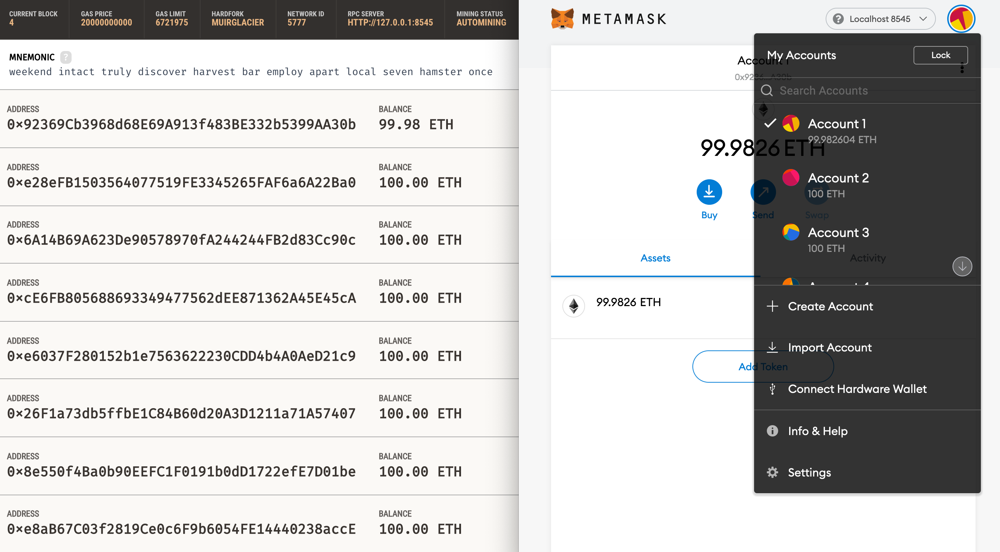  

Configuration is now complete.

### Using the DApp

1. Start the local web server:
```Bash
npm run dev
```
The dev server will launch and automatically open a new browser tab containing your DApp.

2. A MetaMask pop-up should also appear requesting your approval to allow Jun's Doge Emporium to connect to your MetaMask wallet. Without explicit approval, you will be unable to interact with the dapp. Click **Connect**.  

  

The active wallet address will now be displayed under the store name (*Shopping as: 0x...*).

3. To use the DApp, click the **Purchase** button on the doge of your choice. Each doge is priced at 1 ETH. 
4. You'll be automatically prompted to approve the transaction costing 1 ETH (excluding gas fees) by MetaMask. Click **Confirm** to approve the transaction.  

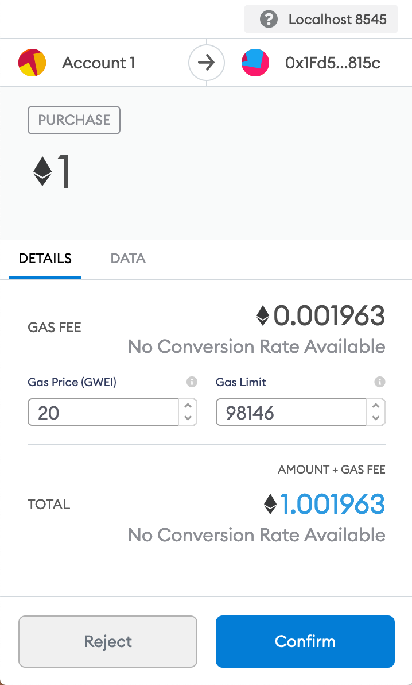  

5. The page should refresh automatically and you'll now see the button for the chosen doge display "Purchased (No longer available)" and become disabled.  

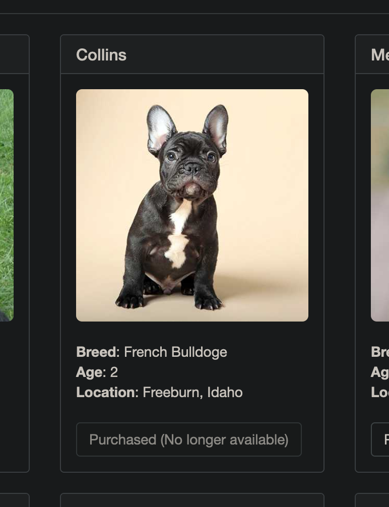  

And in MetaMask, you'll see the transaction listed:  

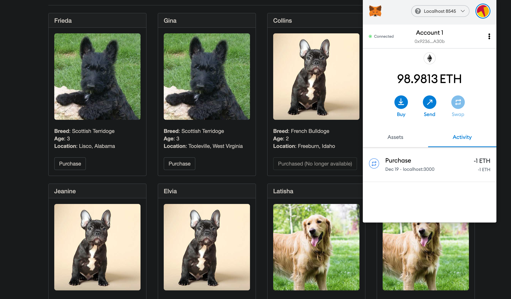  

You'll also see the same transaction listed in Ganache under the "Transactions" section and new ETH balance for the corresponding address.

6. In order to use the shop discount, select another doge. MetaMask should now prompt you with a transaction costing 0 ETH.  

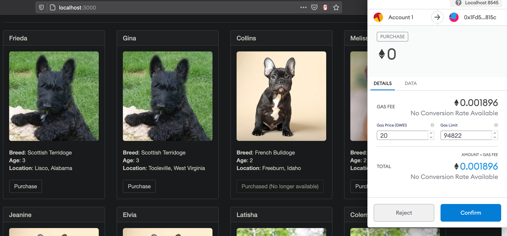  

7. The wallet address that established the contract is the owner of the shop. Only the owner has access to the **Reset** button. The **Reset** button reverts all previous transactions at the shop and costs 0 ETH.
Once reset, a **Withdraw** button becomes available. Only customers who have spent ETH before the reset will have access to the **Withdraw** button.  

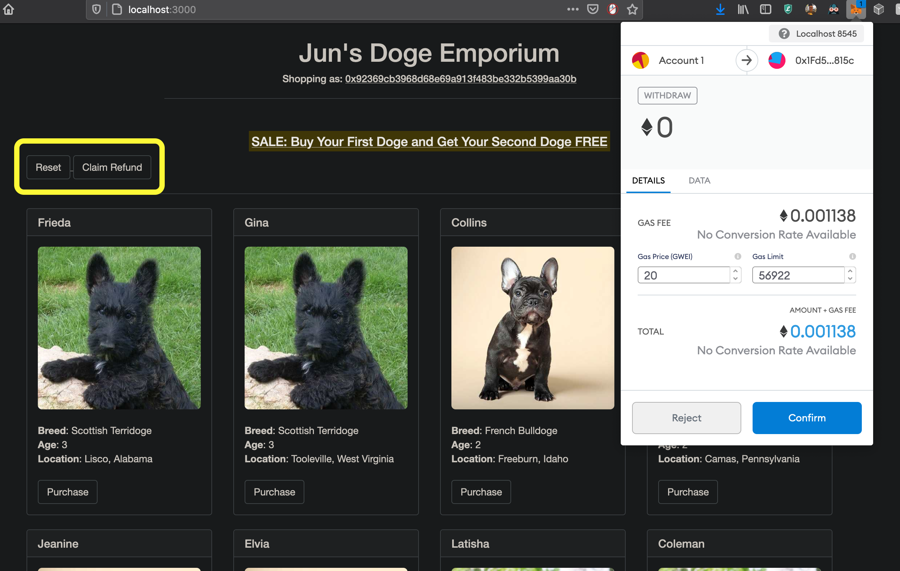  

Here's a condensed version of step 7 where the owner purchases 2 doges with the shop discount, resets the store and withdraws the 1 ETH previously spent:  

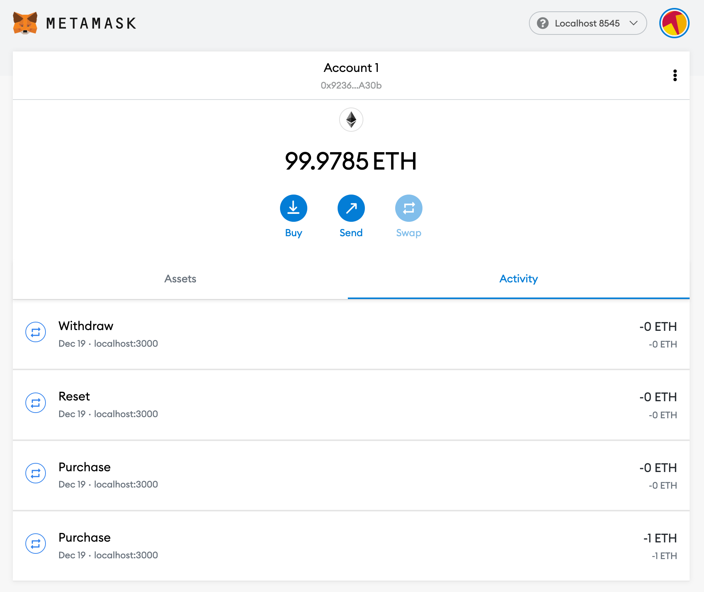  

The wallet has virtually returned to the original balance of 100 ETH minus gas fees from contract migration and transactions.


## Demo

Here's a [video](https://vimeo.com/485815714) walkthrough of the DApp in action.